# Library Web App Project 

Name: Jonathan Hew 
Languages: HTML, PHP, CSS, SQL
Services: MySQL Database, Apache Web Services

# Description of the project
The aim of this project is to develop a book reservation web site using PHP and MySQL database. The application will allow users to search for and reserve library books. Specifically, the application will enable the following:

  - Login - The user must identify themselves to the system in order to use the system and throughout the whole site. If they have not previously used the system, they must register their details.

  - Registration - This allows a user to enter their details on the system. The registration process validates that all details are entered. Mobile phone numbers should be numeric and 10 characters in length. Password should be six characters and have a password confirmation function. The system ensures that each user can be identified using a unique username. 

  - Search for a book: The system allows the user to search in a number of ways: 
    - by book title and/or author (including partial search on both) 
    - by book category description in a dropdown menu (book category should retrieved from database

  - The results of the search displays as a list from which the user can then reserve a book if available. If the book is already reserved, the user is not allowed to reserve the book.

  - Reserve a book – The system allows a user to reserve a book provided that no-one else has reserved the book yet. The reservation functionality will capture the date on which the reservation was made.

  - View reserved books – the system allows the user to see a list of the book(s) currently reserved by that user. User should be able to remove the reservation as well

CSS is also used to make the web pages look neat and tidy


# Youtube Video Link 
Please click on the video image below to view the demo of this project.

[](https://youtu.be/PvWy_KmDee4)


# Instructions
This project was created using XAMMP 7.4.10-0
  - Download this repository into XAMMP/htdocs
  - Run XAMMP and start MySQL Database and Apache Web Server services
  - On web browser go to address  http://localhost/CA/index.php
   
# How it works
## db.php
The first page I created was db.php. This page connects the website to the database which I created. 
```PHP
 $db = mysqli_connect('localhost', 'root', '', 'CA_Books');
			if ($db === False ) die ('Fail Message');
```

If a page needs a connection to the database it can do so by using the "require_once" function.

```PHP
  require_once "db.php";
```

## login.php
login.php will occur if you try to access any of the main website pages and the server doesn’t recognise any previous session log ins. The login page contains a simple HTML form which asks the user for their username and password and uses the post method to check if it exists in the database. 

```HTML
<form method="post">
  <p>Username: <input type="text" name="account" value=""></p>
  <p>Password: <input type="text" name="pw" value=""></p>
  <p><input type="submit" value="Log In" name="submit_clicked" id="submit_clicked"></p>
</form>

```

If the username doesn’t exist or the password doesn’t match, the user will be sent back to the login page again. If the user logs in successfully they will be allowed to access the site. They will be redirected to index.php. 

``` PHP
<?php
      require_once "db.php";
      session_start();    
      unset($_SESSION["account"]);    
      if(isset($_POST['submit_clicked']))
      {    
        $username = mysqli_real_escape_string($db,$_POST['account']);
          $password = mysqli_real_escape_string($db,$_POST['pw']);

        if ($username != "" && $password != "")
          {
          $sql_query = "select count(*) as cntUser from users where username='".$username."' and password='".$password."'";
          $result = mysqli_query($db,$sql_query);          
          $row = mysqli_fetch_array($result);

          $count = $row['cntUser'];

          if($count > 0)
          {
                  $_SESSION['username'] = $username;
                  header('Location: index.php');
              }//end if
              else
              {
                echo "Invalid username and/or password";
              }//end else
        }//end if
      } //end if
 ?>
``` 

login.php also includes a function to allow new users to register. If the register button is clicked the user is redirected to register.php.
```HTML
<p> Dont have an account?</p> 
<a href= "register.php">Register here!</a>
```

## logout.php
If logged in and on the index.php page the user can logout by clicking on the logout button. This will redirect them to logout.php. 
```PHP
Welcome <?php echo $_SESSION["username"]; ?>. Click here to <a href="logout.php" tite="Logout">Logout.
```
This page contains a session_destroy which will log them out. It then redirects the user to index.php.
```PHP
session_destroy();
header("Location: index.php");
```

## index.php
The main purpose for the index.php is to allow the user to logout. The index page greets the user by their username and has an option to log out beside it. This page can be accessed on any page by clicking the “home” button on the navigation bar near the header.
```HTML
<nav>
  <a href="index.php">Home</a>
  ...
```

## search.php
The main purpose of this page is to offer the user an option to search for a book by category or by book title and author. 
```HTML
<a href="searchbook_form.php">Search by Book or Author </a>
<br><br>
<a href="searchcategory_form.php">Search by Category </a>
```
This page can be accessed by any page by clicking on the “search” button in the navigation bar.
```HTML
<nav>
  ...
  <a href="search.php">Search </a>
  ...
```
If the link to search by category is clicked a table of categories will appear with a “search” button beside it. A SQL query to select all book categories in the database is executed and the results are put into a table.
```PHP
<?php
  require_once "db.php";
  $sql = "select * from Categories";
  $result = $db->query($sql);

  echo '<table border="1">'."\n";

  if($result->num_rows > 0)
  {
      echo "<tr><th>CategoryID</th> 
            <th>CategoryDesc</th>
            <th>Search</th></tr>";
      while ($row = mysqli_fetch_array($result)) 
      {
          echo "<tr><td>";
          echo(htmlentities($row["CategoryID"]));
          echo("</td><td>");
          echo(htmlentities($row["CategoryDesc"]));
          echo("</td><td>");
          echo('<a href="searchcategory_result.php?id='.htmlentities($row[0]).'">Search</a> ');


      }//end while 
  }//end if
  ?>
```

Once one of the search buttons is clicked the books in the corresponding category will be displayed only to view. This is done by passing the corresponding categoryID to the results page, 
``` PHP
echo('<a href="searchcategory_result.php?id='.htmlentities($row[0]).'">Search</a> ');
```
The results page retrives the categoryID by
``` PHP
$id = mysqli_real_escape_string($db, $_GET['id']);
```
The results page retrives the books in that category by running the follwing SQL query. The system will also count the the amount of resukts returned. If 0 results are returned the system will let the user know there are currently no books in that category at the moment. 
``` PHP
$sql = "SELECT * FROM Books WHERE CategoryID='$id'";
$run = mysqli_query($db,$sql);
$foundnum = mysqli_num_rows($run);
```

If the link to search by book title or author is clicked a search form appears. Here the user can enter words or names and any books with similar titles or authors to the word will appear. The words or names entered by the user is passed to the results page.
```HTML
<form action="searchbook_result.php" method="GET">
    <input type="text" name="query" />
    <input type="submit" value="Search" name="submit_clicked" />
    <a href="search.php">Cancel</a>
</form>
```
The application will retrieve the words or names from the form and execute a SQL query to find books with similar title or author name. It will also count how many results are returned. If 0 results are returned the system will let the user know that it could not find any similar book / author.
```PHP
<?php
  require_once "db.php";
  $query = $_GET['query'];


  echo '<table border ="1">'."\n";
  $sql = "SELECT * from Books 
  WHERE 
  (BookTitle LIKE ('%". $query . "%' ))
  OR
  (Author LIKE ('%". $query . "%' ))";

  $run = mysqli_query($db,$sql);
  $foundnum = mysqli_num_rows($run);
  
  ...
```

## reservebook.php
The main purpose of this page is to offer the user the option to reserve a book.
Just like search.php the website allows the user to search for a book by category or book title and author. This time the results will only show books that are not already reserved. 
``` PHP
$sql = "SELECT * FROM Books WHERE CategoryID='$id' AND Reserved = 'N'";
```

It will also have a “reserve” button beside each book in the results of the search. If the user clicks this button the book becomes reserved in their name and it will no longer be available to reserve by anyone else until the user returns it. The current date is also captured when the user reserves a book.
```PHP
<?php
  session_start();
  require_once "db.php";

  $id = mysqli_real_escape_string($db, $_GET['id']);
  $dt1=date("Y-m-d");
  $username = $_SESSION["username"];


  $sql = "UPDATE Books SET Reserved = 'Y' WHERE ISBN = '$id'";

  $sql2 = "INSERT INTO Reservations (ISBN, Username, ReservedDate) VALUES ('$id', '$username', '$dt1' )";

  echo "<pre>\n$sql\n</pre>\n";
  echo "<pre>\n$sql2\n</pre>\n";

  mysqli_query($db,$sql);
  mysqli_query($db,$sql2);

  echo 'Updated! You have reserved this book. Enjoy -<a href="reservebook.php">Continue...</a>';

?>
```

## viewbooksreserved.php
The main purpose of this page was to allow the user to see how many books they currently have reserved and also to offer them the option to return any books they have. This page can be accessed by any page by clicking on the “Reserved” button in the navigation bar.
```HTML
<nav>
  ...
  <a href="viewreservedbooks.php">View Reserved Books </a>
  ...
```
When the user clicks on this button a list of their reserved books along with the date the book was reserved appears. It will also count the amount of results returned. The system will let the user know that they have no reservations if 0 results are returned
```PHP
<?php
  require_once "db.php";

  $username = $_SESSION['username'];

  echo '<table border ="1">'."\n";
  $sql = "SELECT ISBN, BookTitle, Author, ReservedDate FROM Reservations JOIN Books USING (ISBN) WHERE Username = '$username' ";
  $result = mysqli_query($db,$sql);
  $foundnum = mysqli_num_rows($result);
  
  ...
```
A button to return the book also appears beside each book. If the return button is clicked, the corresponding book becomes available once again to be reserved and the book will no longer be in the users reserved books list. This is done by passing the bookID to the return page
```PHP
echo('<a href="returnreservedbook.php?id='.htmlentities($row[0]).'">Return It</a>');
```
The return page retrieves the bookID and changes the status by running the following SQL queries 
```PHP
<?php
  session_start();
  require_once "db.php";

  $username = $_SESSION['username'];

  if ($_GET || id['id']) 
  {
      $id = mysqli_real_escape_string($db, $_GET['id']);
  } 
  else 
  {
      echo 'Value was not brought over';
  }

  $sql= "DELETE FROM Reservations WHERE ISBN = '$id' AND Username = '$username'";

  $sql2 = "UPDATE Books SET Reserved = 'N' WHERE ISBN = '$id'";


  echo "<pre>\n$sql\n</pre>\n";
  echo "<pre>\n$sql2\n</pre>\n";

  mysqli_query($db,$sql);
  mysqli_query($db,$sql2);

  echo 'Success! You have returned the book. Thank You -<a href="viewreservedbooks.php">Continue...</a>';
?>
```

# Design
## Low Fidelity Prototypes
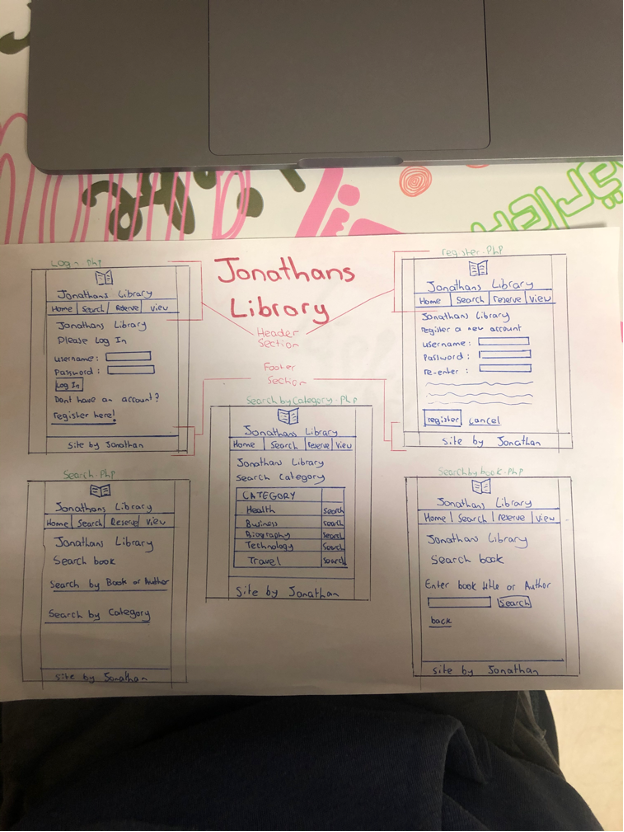
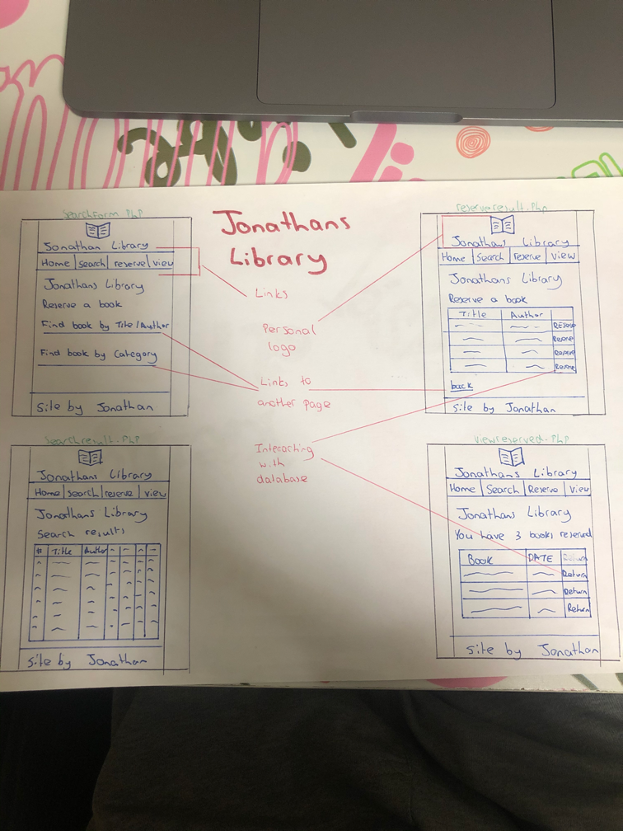

# What I am most proud of in the assignment

# Pages I created
## login.php
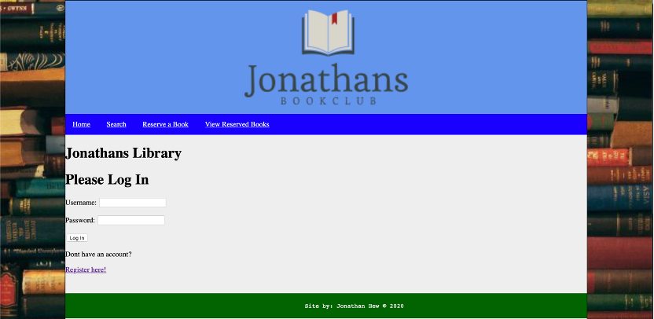
## index.php

## register.php
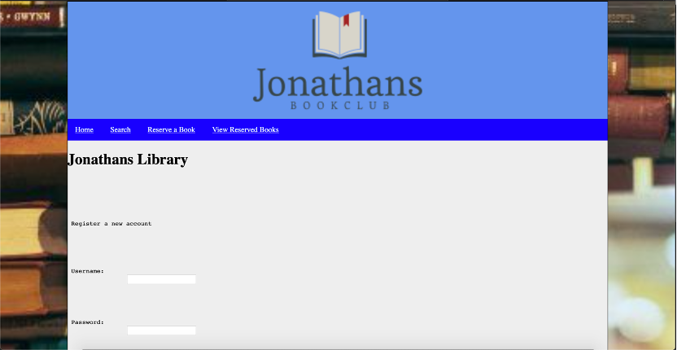
## search.php
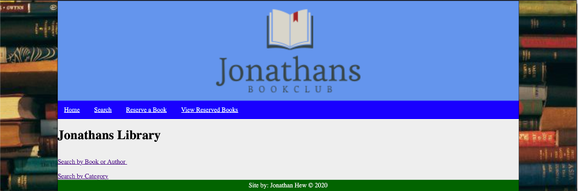
## searchbook_form.php
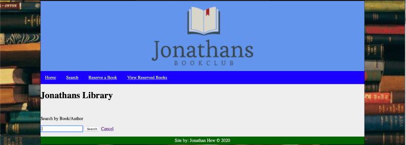
## searchbook_result.php
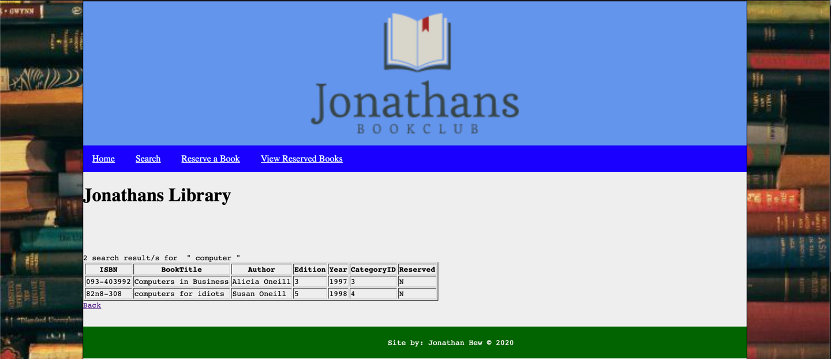
## searchCategory_form.php
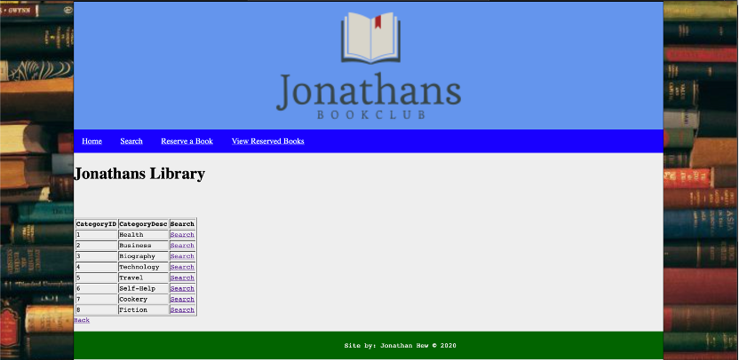
## searchCategory_result.php
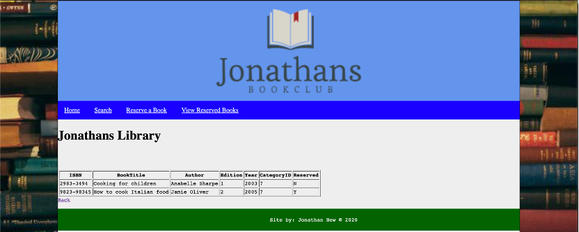
## reserveSearchBook_result.php

## reserveSearchCategory_result.php
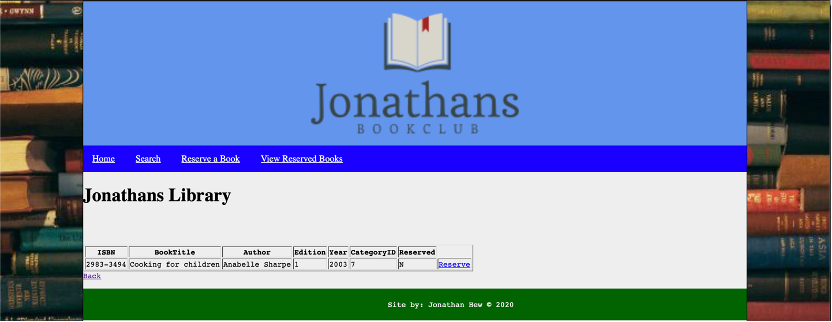
## ViewReservedBooks.php
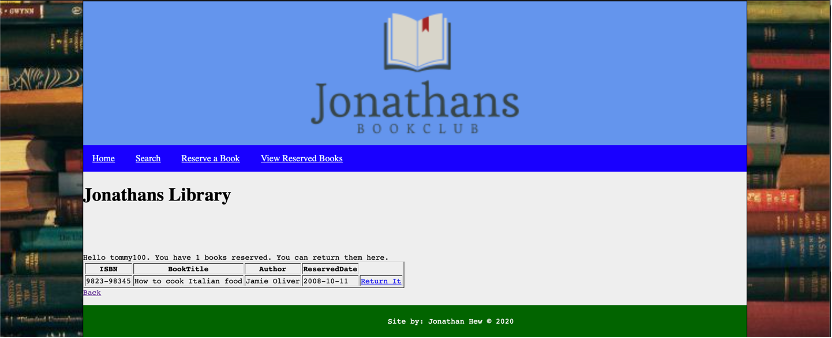
